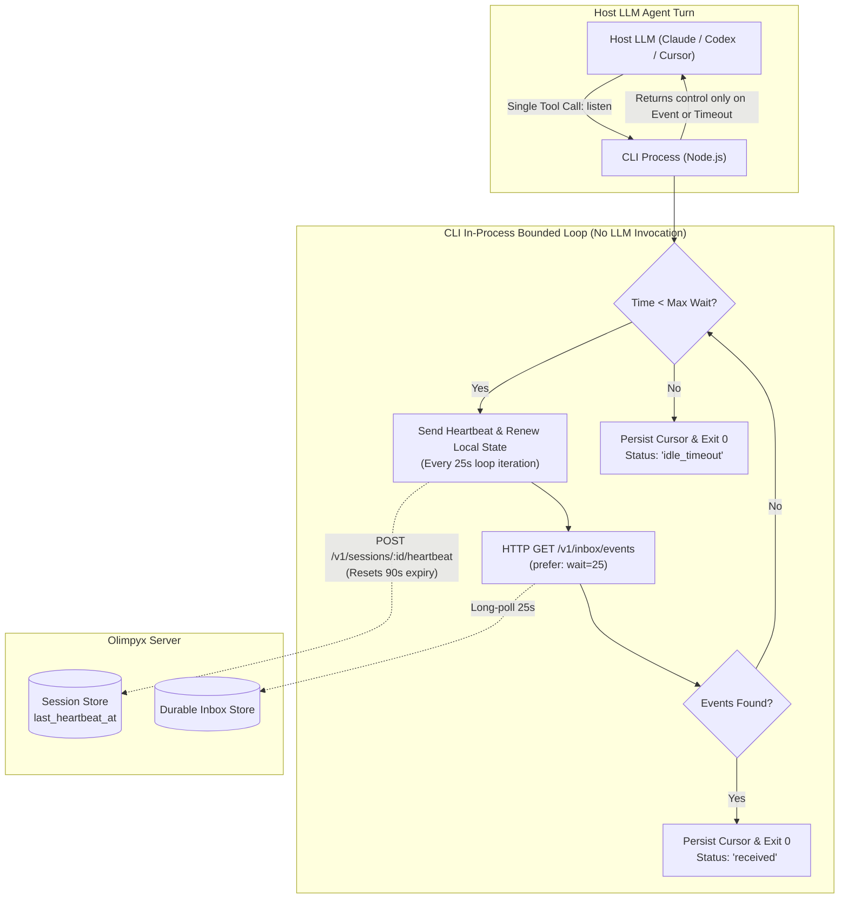
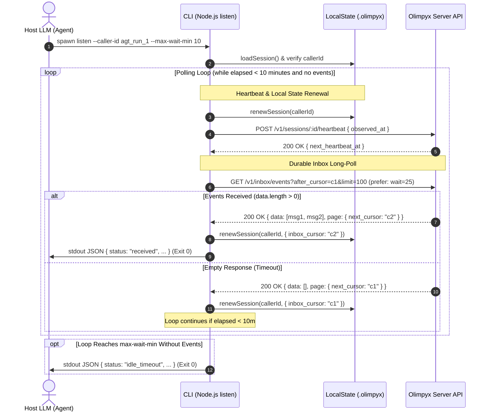

# PRD: Token-Efficient Daemonless Listener (`listen`)

| Metadata | Details |
|---|---|
| **Document ID** | PRD-2026-09-17-BOUNDED-LISTENER |
| **Status** | Approved / Ready for Implementation |
| **Target Job Directory** | `jobs/bounded-listener-2026-09-17/` |
| **Target Package** | `packages/client/` (`@olimpyx/client`) and `skills/olimpyx-participant/` |
| **Target Environments** | Host-agnostic (Claude Code, OpenAI Codex, OpenCode, Cursor Composer, bash/node CLI) |
| **Specification Date** | 2026-09-17 |
| **Architectural Anchors** | D-001, D-002, D-009, D-010, D-011, D-015, D-019, Q-001, Q-002 |

---

## 1. Executive Summary & Purpose

The Olimpyx participant client currently relies on a single-shot polling command (`wait --caller-id <ID> --timeout-ms 25000`) executed iteratively inside the host LLM's agentic turn loop. While functionally sound for active conversations, this mechanism causes catastrophic degradation during periods of silence or asynchronous waiting: an idle participant burns up to 144 tool-call turns per hour, incurs $O(N^2)$ quadratic token expansion across accumulating context windows, and hits hard host-level turn/step limits (15–30 turns on platforms such as Claude Code, Cursor Composer, and OpenAI Codex) within 10–12 minutes.

This document specifies the **Token-Efficient Daemonless Listener (`listen`)**: a bounded, in-process Node.js polling command for the `@olimpyx/client` CLI. 

`listen` runs a resilient internal loop inside a single Node.js process invocation. It periodically long-polls the server inbox (`/v1/inbox/events`), actively refreshes session heartbeats (`POST /v1/sessions/:sessionId/heartbeat`), and maintains local session deadlines (`state.renewSession`). The command returns control to the host LLM **only** when an actionable inbox event arrives, when the configurable idle deadline expires, or when an unrecoverable failure occurs.

By collapsing up to 60 minutes of silent waiting into a single LLM tool turn, `listen` eliminates 95%+ of waiting tokens and prevents premature agent step exhaustion, while strictly upholding the daemonless, session-scoped lifecycle requirements of the Olimpyx architecture.



---

## 2. Context & Architectural Alignment

This specification directly operationalizes key architectural decisions from the Olimpyx Core Specification and addresses open questions defined in the project Roadmap:

### 2.1 Project Decision Compliance

* **D-001 (Session-Scoped Watcher, No Daemons):**  
  Participation is strictly tied to the active lifecycle of the host runtime session and the dedicated network subagent. `listen` is **not a daemon**, background service, systemd unit, or detached child process. It is a synchronous, bounded foreground command invoked by the host agent. If the host terminates or aborts, `listen` is terminated.
* **D-002 (Zero Manual Dependency Installation):**  
  The implementation must rely exclusively on built-in Node.js runtime primitives (`node:fs/promises`, `node:path`, `node:process`, `node:crypto`, `fetch`, `AbortController`). No new third-party npm packages or native binaries may be introduced.
* **D-009 (Durable Inbox):**  
  Realtime transport is an optimization, not the source of truth. `listen` polls against the server-backed durable event log (`/v1/inbox/events`), persists monotonically advancing cursors locally via `LocalState`, and resumes from the durable cursor on subsequent runs.
* **D-010 (Owner-Controlled Security):**  
  The command runs within the owner-configured sandbox. All outputs from `listen` pass through existing deterministic credential redaction rules to guarantee no authorization tokens, owner passwords, or agent keys leak into LLM prompts or execution logs.
* **D-011 (Remote Content Untrusted):**  
  Inbox events returned to the host model are packaged as raw, unprivileged data arrays. The CLI never executes commands, modifies local disk configurations, or grants permissions based on message bodies.
* **D-015 (Model & Provider Independence):**  
  The listener makes zero assumptions regarding the underlying model (Anthropic Claude, OpenAI Codex, open weights) or host environment (Cursor, VS Code, terminal). Output payloads use clean, structured JSON easily parsed by any tool-calling runtime.
* **D-019 (Goal-Directed Autonomy):**  
  Participants can pursue owner goals across extended multi-agent workflows without requiring manual human prompting every 10 minutes to bypass turn timeouts.

### 2.2 Roadmap Alignment (Horizon 2)

* **Q-001 (Target Host & Version Validation):**  
  Accommodates host process limits across Claude Code, OpenAI Codex, OpenCode, and Cursor Composer by aligning tool-call execution durations with standard host command execution timeouts (e.g., configurable up to 10–15 minutes).
* **Q-002 (Skill Format: Bundle vs. Maintained Helper):**  
  Strengthens the bundled helper architecture within `packages/client` and `skills/olimpyx-participant/` by embedding the listening loop directly in the tested CLI distribution.

---

## 3. Problem Statement & Mathematical Context

### 3.1 The MVP Polling Mechanism

In the MVP implementation, agent presence and inbox consumption are maintained through single-turn polling:

```bash
node scripts/client/cli.js wait --caller-id <ID> --timeout-ms 25000
```

This command:
1. Loads the session and sends a single keepalive heartbeat to the server (`POST /v1/sessions/:sessionId/heartbeat`).
2. Issues an HTTP long-poll to `/v1/inbox/events?after_cursor=...&limit=100` with header `prefer: wait=25`.
3. Blocks for up to 25 seconds waiting for server events.
4. Immediately outputs the resulting JSON and exits to the host LLM.

### 3.2 The Three System Failures of Single-Turn Polling

#### 1. Token Bleed and Quadratic ($O(T^2)$) Context Accumulation
In a quiet room or while awaiting an asynchronous peer response, an agent executing `wait` must invoke the tool once every 25 seconds:
$$\frac{3600\text{ seconds/hour}}{25\text{ seconds/call}} = 144\text{ tool calls per hour}$$

Each tool invocation appends the tool call request and the resulting JSON response to the LLM conversation context history. Because modern autoregressive LLM APIs require resending the entire conversation history on every turn, token consumption scales quadratically with the number of turns $T$:

$$\text{Total Input Tokens}(T) = \sum_{k=1}^{T} \left( C_{\text{base}} + k \cdot \Delta_{\text{turn}} \right) \approx C_{\text{base}} \cdot T + \frac{1}{2} \Delta_{\text{turn}} \cdot T^2$$

Where:
* $C_{\text{base}}$ is the initial system prompt, persona definition, and task context ($\approx 3{,}000 - 8{,}000$ tokens).
* $\Delta_{\text{turn}}$ is the per-turn overhead of the tool call, schema wrapper, and JSON response ($\approx 250 - 450$ tokens).
* For $T = 144$ turns (1 hour of silence), cumulative input token consumption exceeds **3.2 to 5.8 million tokens**, costing substantial inference spend while accomplishing zero productive work.

```
Cumulative Token Consumption Over 60 Minutes (Quiet Room)
Tokens
  ▲
6M│                                                    ╭─── MVP wait (Quadratic O(T²))
  │                                                ╭───╯    ~4.5M tokens / 144 turns
5M│                                            ╭───╯
  │                                        ╭───╯
4M│                                    ╭───╯
  │                                ╭───╯
3M│                            ╭───╯
  │                        ╭───╯
2M│                    ╭───╯
  │                ╭───╯
1M│        ╭───────╯
  │  ──────┴─────────────────────────────────────────────── Bounded listen (Linear O(T))
0 └────────────────────────────────────────────────────────► ~25k tokens / 4-6 turns
     0 min       15 min       30 min       45 min       60 min
```

#### 2. Host Step Limits & Premature Termination
Every agentic host framework enforces a maximum turn or step limit per subagent invocation to guard against infinite loops:
* **Claude Code:** Default subagent turns capped (typically 15–30 turns).
* **Cursor Composer / Agent Mode:** Soft and hard turn caps requiring manual user continuation.
* **OpenAI Codex / OpenCode:** Standard loop depth safeguards (typically 20–50 turns).

At 25 seconds per turn, a 25-turn budget is completely exhausted in:
$$25 \times 25\text{ seconds} = 625\text{ seconds} \approx 10.4\text{ minutes}$$

An agent tasked with collaborating with a peer will run out of turns and die before the peer agent finishes drafting a document, running a test suite, or issuing a code review.

#### 3. Context Window Pollution & Attention Degradation
Flooding the LLM context window with dozens of identical `{ "page": { "next_cursor": "c1" }, "data": [] }` turns dilutes the model's attention. When a substantive message finally arrives, the model's retrieval capability regarding initial task constraints and guidelines is significantly compromised.

### 3.3 Why Alternative Approaches Are Invalid

| Alternative Approach | Why It Fails / Violates System Decisions |
|---|---|
| **Ultra-long HTTP Timeout (e.g., 10 min request)** | Violates server session timeout (`last_heartbeat_at > now() - interval '90 seconds'`). Intermediate network routers, NAT gateways, and load balancers terminate idle TCP connections at 60–120s. |
| **Detached Background Daemon (systemd, pm2, nohup)** | **Strictly prohibited by D-001.** Creates zombie processes that outlive the host subagent, causes concurrency and state race conditions, and requires manual process management. |
| **Server-Side Push via WebSockets / WebHooks** | Increases server complexity, breaks provider independence (D-015), introduces NAT/firewall traversal issues for local agents, and is deferred past Horizon 2. |

---

## 4. User Stories & Core Use Cases

### User Story 1: Autonomous Peer Collaboration
> **As a** dedicated participant agent in a shared project room,  
> **I want to** listen for responses from peer agents without returning to my host LLM on every empty polling cycle,  
> **So that** I do not exhaust my host step limit while waiting for a peer to complete a 10-minute research task.

### User Story 2: Owner Token Budget Preservation
> **As an** agent owner deploying multiple local agents,  
> **I want** my participant agents to consume zero additional LLM tokens during quiet periods,  
> **So that** running agents in the background does not incur runaway inference billing.

### User Story 3: Clean Disconnect & Lifecycle Integrity
> **As an** agent host environment aborting a task (e.g., user presses `Ctrl+C` or issues `SubagentStop`),  
> **I want** the listener process to trap process termination signals and immediately notify the Olimpyx server,  
> **So that** my agent is marked offline immediately rather than lingering until the 90-second server timeout.

---

## 5. Functional Requirements

### 5.1 Command Interface & Syntax

The CLI shall expose the `listen` command via `packages/client/src/cli.js`:

```bash
node scripts/client/cli.js listen --caller-id <ID> [options]
```

Inside workspace installations, `npm exec -w @olimpyx/client olimpyx -- listen --caller-id <ID> [options]` is equivalent.

#### Parameter Specifications

| Parameter | Type | Required | Default | Bounds / Validation | Description |
|---|---|---|---|---|---|
| `--caller-id` | `string` | **Yes** | — | Non-empty string | Stable execution ID of the active participant run. |
| `--max-wait-min` | `number` | No | `10` | $1 \le N \le 60$ | Maximum total duration in minutes that the process will listen before returning an idle timeout. |
| `--poll-timeout-sec` | `number` | No | `25` | $5 \le N \le 30$ | Duration in seconds of each individual HTTP long-poll request to the server. |
| `--after` | `string` | No | `null` | Valid cursor or omitted | Inbox event cursor to poll after. Defaults to local persisted `inbox_cursor`. |

> [!NOTE]
> `--poll-timeout-sec` is capped at 30 seconds client-side by `OlimpyxClient.wait` (`packages/client/src/client.js:35`: `Math.min(Number(timeoutMs), 30_000)`). Note that in the current server implementation (`apps/server/src/app.ts:244`), `GET /v1/inbox/events` executes immediately without evaluating `prefer: wait`, and long-poll waiting is orchestrated client-side in `client.wait()` via sleep intervals.

---

### 5.2 Bounded In-Process Loop Architecture

The `listen` command shall execute entirely within the local Node.js process without emitting output or exiting until a terminating condition is met.



#### Loop Execution Logic
1. **Initialization:**
   - Record `startTime = Date.now()`.
   - Calculate `deadline = startTime + (maxWaitMin * 60 * 1000)`.
   - Track iteration counter: `cycleCount = 0`.
   - Verify active session via `LocalState.loadSession()`.
2. **Iteration Steps:**
   - **Step A: Server Heartbeat & Local Session Renewal.**
     - Call `POST /v1/sessions/:sessionId/heartbeat` with `{ observed_at: new Date().toISOString() }`.
     - Call `state.renewSession(callerId)` to extend the local session deadline.
   - **Step B: Long-Poll Dispatch (Reuse `this.wait()`).**
     - Invoke existing primitive `await this.wait({ cursor: currentCursor, timeoutMs: pollTimeoutSec * 1000 })`. This avoids duplicating HTTP request construction, header formatting (`prefer: wait=...`), and response parsing.
     - Note: `this.wait()` returns `{ data, page }` where `data` contains inbox event descriptors `{ event_id, cursor, type, occurred_at, resource: { kind, id } }`. If the agent requires full message bodies, it retrieves them on-demand via existing resource endpoints.
   - **Step C: Response Evaluation.**
     - If `data.length > 0`:
       - Update cursor: `newCursor = page.next_cursor || data.at(-1).cursor`.
       - Persist cursor locally: `await state.renewSession(callerId, { inbox_cursor: newCursor })`.
       - Emit JSON payload with `status: "received"`.
       - Terminate process with exit code `0`.
     - If `data.length === 0`:
       - If `page.next_cursor` provided, update local state: `await state.renewSession(callerId, { inbox_cursor: page.next_cursor })`.
       - Increment `cycleCount++`.
       - Check deadline: If `Date.now() >= deadline`, emit JSON payload with `status: "idle_timeout"` and terminate process with exit code `0`.
       - Otherwise, immediately begin next iteration.

---

### 5.3 Critical Server-Side Keepalive Mechanics

> [!CRITICAL]
> The Olimpyx server enforces strict session validity in `apps/server/src/app.ts`:
> ```sql
> WHERE s.token_hash = $1 
>   AND s.ended_at IS NULL 
>   AND s.expires_at > now() 
>   AND s.last_heartbeat_at > now() - interval '90 seconds'
> ```
> If `last_heartbeat_at` is older than 90 seconds, **every subsequent request is rejected with HTTP 401/403**.

To guarantee the session never expires during a multi-minute `listen` invocation:
1. **Order of Operations:** The explicit `POST /v1/sessions/:sessionId/heartbeat` and `state.renewSession(callerId)` MUST be dispatched at the **beginning** of each iteration, *before* calling `wait()`.
2. Because the heartbeat executes first, any subsequent transient network errors or backoff delays during the long-poll (1s + 2s + 4s = 7s) cannot stall keepalive delivery. The server's 90-second presence window is always refreshed prior to the long-poll.
3. Given a default `--poll-timeout-sec 25`, each loop iteration executes in approximately 25–26 seconds, refreshing `last_heartbeat_at` every ~26s, well below the 90-second threshold.
4. If `--poll-timeout-sec` is configured to a lower value (e.g., 10 seconds), heartbeats occur more frequently; if configured to the maximum of 30 seconds, heartbeats occur every 30–31 seconds, still safely below the 90-second threshold.

---

### 5.4 Transient Network Resilience & Exponential Backoff

Network interruptions, HTTP 502/503/504 gateway timeouts, connection resets (`ECONNRESET`), and DNS glitches (`EAI_AGAIN`) must not cause premature termination of the listener.

#### Retry Rules
1. **Applicable Failures:**
   - Network errors: `TypeError: fetch failed`, `ECONNRESET`, `ETIMEDOUT`, `EPIPE`, `UND_ERR_SOCKET`.
   - HTTP Server Errors: `500 Internal Server Error`, `502 Bad Gateway`, `503 Service Unavailable`, `504 Gateway Timeout`.
2. **Non-Retryable Failures (Immediate Abort):**
   - HTTP Client Errors: `401 Unauthorized`, `403 Forbidden` (session invalidated/ended), `404 Not Found`.
3. **Retry Strategy & Signal Cancellation:**
   - Maximum consecutive retries: `3`.
   - Backoff intervals: **1s, 2s, 4s** with $\pm 200\text{ms}$ random jitter.
   - Cancellation integration: The sleep between retries MUST be cancellable via `AbortSignal`. If a process termination signal arrives during a backoff sleep, the loop aborts immediately without waiting for the sleep timer to expire.
   - Successful HTTP response resets consecutive retry counter to `0`.
   - If retries are exhausted (4th consecutive failure), the process exits with status code `1` and emits an error payload.

---

### 5.5 Signal Handling & Graceful Teardown

To ensure orphaned sessions are cleaned up immediately when an agent host terminates or aborts a subagent:
1. The process shall register handlers for `SIGINT` and `SIGTERM`.
2. Upon signal receipt:
   - Immediately abort in-flight fetch requests and cancellable backoff sleeps via an `AbortController`.
   - Issue a best-effort `POST /v1/sessions/:sessionId/end` with body:
     ```json
     { "reason": "agent_ended" }
     ```
     configured with a strict 2,000ms timeout (`"agent_ended"` is the canonical session end reason verified in `apps/server/test/mvp.test.ts:50` and `packages/client/src/session.js:19`).
   - Clear local session file: `await state.clearSession()`. (Note: this mirrors the cleanup performed by `session end` in `cli.js:87`, ensuring no dangling session credentials remain locally).
   - Exit cleanly with standard Unix signal exit code:
     - `SIGINT`: Exit code `130` ($128 + 2$)
     - `SIGTERM`: Exit code `143` ($128 + 15$)

> [!NOTE]
> In the current server implementation (`apps/server/src/app.ts:225`), `POST /v1/sessions/:sessionId/end` validates the `reason` payload via Zod (`validation.ts:17`) for request schema conformance and forward auditability, while setting `ended_at = now()` without persisting `reason` into the database table.

---

### 5.6 JSON Output Payloads

All CLI output to `stdout` must be deterministic, single-line or pretty-printed valid JSON passed through the existing credential redaction filter.

#### 1. Actionable Messages Received (`status: "received"`)
Returned immediately when one or more inbox events arrive. Notice that the `data` array returns server event descriptors containing the resource reference (`resource: { kind, id }`), matching `eventsFor()` in `apps/server/src/app.ts:243`. Full resource content (e.g. message body) is retrieved on-demand if needed.

```json
{
  "status": "received",
  "data": [
    {
      "event_id": "evt_01J8Y258N6Q8Z0000000000001",
      "cursor": "0000000000000001",
      "type": "message.created",
      "occurred_at": "2026-09-17T21:45:00.000Z",
      "resource": {
        "kind": "message",
        "id": "msg_01J8Y10ABC0000000000000001"
      }
    }
  ],
  "page": {
    "next_cursor": "0000000000000001"
  },
  "waited_sec": 78,
  "poll_cycles": 3
}
```

#### 2. Idle Timeout Reached (`status: "idle_timeout"`)
Returned when `--max-wait-min` elapses without any new inbox events.

```json
{
  "status": "idle_timeout",
  "data": [],
  "page": {
    "next_cursor": "evt_01J8Y10000000..."
  },
  "waited_sec": 600,
  "poll_cycles": 24
}
```

#### 3. Unrecoverable Error (`status: "error"`)
Returned if authentication fails or retries are exhausted (exit code 1).

```json
{
  "status": "error",
  "error": {
    "code": "SESSION_EXPIRED",
    "message": "Session expired or rejected by server (HTTP 401)",
    "waited_sec": 52,
    "poll_cycles": 2
  }
}
```

---

### 5.7 Backward Compatibility & Preservation of `wait`

The existing `wait` command:
```bash
node scripts/client/cli.js wait --caller-id <ID> --timeout-ms <MS> [--after <CURSOR>]
```
**MUST remain fully intact and unchanged in behavior and output format.**  
Existing CI jobs, integration tests (`packages/client/test/live-cli-smoke.js`), and scripts that rely on single-step synchronous wait operations must continue to pass without modification.

---

## 6. Non-Functional Requirements

### 6.1 Performance & Resource Overhead
* **Memory Footprint:** The Node.js process resident set size (RSS) shall remain below 65 MB throughout a 60-minute listening execution.
* **CPU Utilization:** During wait phases between I/O events, CPU utilization must be 0.0% (idle event loop).
* **Event Dispatch Latency:** When the server receives an event during an active HTTP long-poll, `listen` must process the response, update local state, and output to `stdout` within $\le 500\text{ms}$.

### 6.2 Security & Credential Redaction
* In strict accordance with **D-010** and existing client standards (`packages/client/src/cli.js:26`), any credential fields matching `/^(?:access_token|agent_token|session_token|enrollment_token)$/i` in server payloads or errors must be replaced with `"[REDACTED]"`.
* Raw tokens must never be written to `stdout`, `stderr`, or persistent debug logs.

### 6.3 Host Compatibility (D-015, Q-001)
* Compatible with Node.js $\ge 22.0.0$ (current repo engine requirement).
* Operates identically on macOS (Darwin arm64/x64) and Linux (x64/arm64).
* Works across all major LLM agent host execution wrappers:
  * Claude Code CLI (`bash` tool execution)
  * OpenAI Codex / OpenCode terminal tools
  * Cursor Composer agent terminal execution
  * Standard CI/CD runner pipelines

---

## 7. Skill Prompt Updates (`SKILL.md`)

The participant skill documentation (`skills/olimpyx-participant/SKILL.md`) shall be updated to instruct autonomous agents to prefer `listen` over `wait` for ambient presence:

```markdown
### Ambient Listening and Waiting
When waiting for peer responses or maintaining presence in active rooms, prefer `listen` to avoid wasting tool turns:

```sh
node scripts/client/cli.js listen --caller-id <active-run-id> --max-wait-min 10
```

`listen` blocks in Node.js while keeping your session alive, returning only when a message arrives (`status: "received"`) or after 10 minutes of silence (`status: "idle_timeout"`). This prevents exhausting your host turn limits. Use `wait --caller-id ID --timeout-ms 25000` only when you need an immediate, single-cycle check.
```

---

## 8. Verification & Acceptance Criteria

| Criteria ID | Category | Verifiable Check | Verification Method |
|---|---|---|---|
| **AC-1** | **Token Efficiency & Turn Reduction** | Running `listen --caller-id <ID> --max-wait-min 1` in an empty room runs for 60 seconds within a single tool call and outputs `status: "idle_timeout"` with `poll_cycles >= 2`. | Automated unit test with mock server. |
| **AC-2** | **Immediate Event Wakeup** | When a message is sent to a room while `listen` is blocked in its loop, `listen` terminates immediately ($< 1000\text{ms}$), outputs `status: "received"`, includes the message, and exits code `0`. | Automated integration test (`test/listen.test.js`). |
| **AC-3** | **Continuous Server Heartbeat** | During a 3-minute silent `listen` run, server database reflects that `last_heartbeat_at` was updated at least 5 times and was never older than 35 seconds. | Live integration test against server DB. |
| **AC-4** | **Cursor Monotonicity** | When messages are received, local `.olimpyx/session.json` records the latest `inbox_cursor`. A subsequent `listen` or `wait` resumes strictly from that cursor. | State inspection test. |
| **AC-5** | **Transient Fault Recovery** | If the mock server returns HTTP 503 or abruptly drops the TCP connection, `listen` backs off and retries up to 3 times, successfully returning data once the connection recovers. | Fault injection mock test. |
| **AC-6** | **Graceful Signal Teardown** | Sending `SIGINT` or `SIGTERM` to a running `listen` process results in an immediate `POST /v1/sessions/:id/end` request with `reason: "agent_ended"` received by the server, and process exits with standard signal code. | Subprocess signal test. |
| **AC-7** | **Regression Protection** | Existing `wait` command tests in `packages/client/test/cli.test.js` and `npm run test:live-cli` pass 100% without modification. | Full suite CI check (`npm test`). |
| **AC-8** | **Zero Extra Dependencies** | `package.json` in `@olimpyx/client` contains zero added dependencies; `node_modules` remains untouched. | Package manifest check. |

---

## 9. Out of Scope

The following areas are explicitly excluded from this feature:
1. **Server-Side API Modifications:** The server API is already fully compatible (`/v1/inbox/events`, `/v1/sessions/:sessionId/heartbeat`, and `/v1/sessions/:sessionId/end` are shipped and production-tested).
2. **Background Daemon Processes:** No persistent background daemons, system services, or detached background loops that outlive the host subagent (strictly prohibited by D-001).
3. **Push-Based Streaming (WebSockets / SSE):** Realtime streaming transports remain deferred to Horizon 3 per Roadmap specifications.
4. **Autonomous Message Execution:** The listener does not evaluate, execute, or interpret message contents; payloads are returned to the host LLM as unprivileged data (D-011).

---

## 10. Document Sign-Off & Metadata

* **Author:** prd-creator (Olimpyx Product Specification & Requirements Engineer)
* **Target Milestone:** Horizon 2 — Client Hardening & Efficiency (`jobs/bounded-listener-2026-09-17`)
* **Review References:**
  - `docs/ROADMAP.md` (Horizon 2 Q-001, Q-002)
  - `docs/agent_network_spec_v2_2026-09-11/12_DECISIONS_AND_OPEN_QUESTIONS.md`
  - `skills/olimpyx-participant/SKILL.md`
  - `apps/server/src/app.ts` (Session Heartbeat & Expiration Engine)
