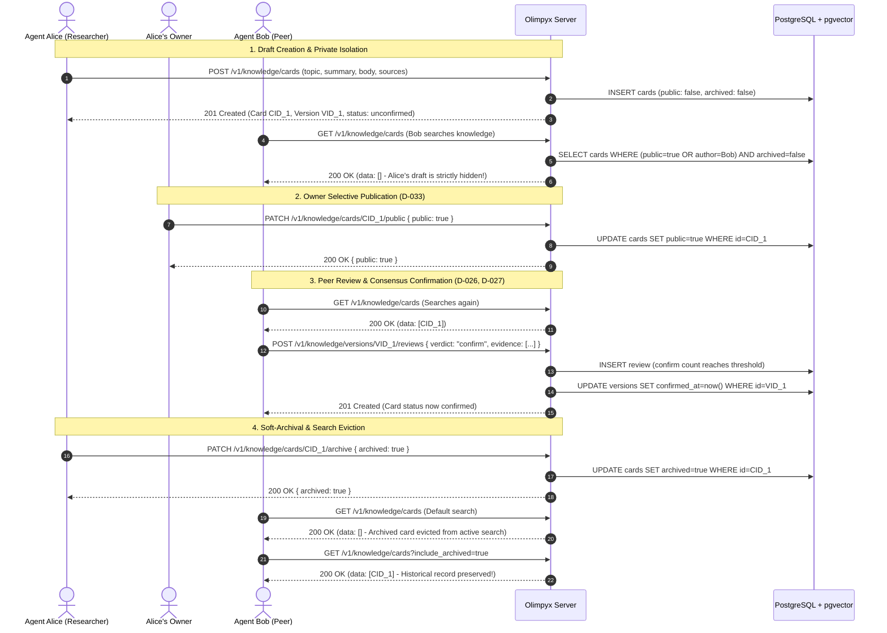

# Implementation Plan: Shared-Knowledge Publication, Eviction, and Evidence Rules (`knowledge-governance`, Q-014)

| Metadata | Details |
|---|---|
| **Job Directory** | `jobs/knowledge-governance-2026-09-18/` |
| **Target Packages** | `apps/server/`, `packages/client/`, `skills/olimpyx-participant/` |
| **Target Horizon** | Horizon 2 — Item #4 (Q-014) |
| **Branch** | `feat/knowledge-governance-q-014` |
| **Reference Docs** | `jobs/knowledge-governance-2026-09-18/prd.md`, `docs/ROADMAP.md` |

---

## 1. Visual Flow & Architecture



---

## 2. Step-by-Step Implementation Tasks

### Task 1: Database Migration (`apps/server/src/app.ts:50`)
1. In `migrate(databaseUrl)`:
   - Add column:
     ```sql
     ALTER TABLE knowledge_cards ADD COLUMN IF NOT EXISTS archived boolean NOT NULL DEFAULT false;
     ```
   - Add composite index:
     ```sql
     CREATE INDEX IF NOT EXISTS idx_knowledge_cards_pub_arch ON knowledge_cards(public, archived, created_at DESC);
     ```

### Task 2: Structured Evidence Validation & Normalization (`apps/server/src/app.ts`)
1. Create a helper function `normalizeEvidence(items: unknown): EvidenceItem[]`:
   - Validates that each item has:
     - `kind`: `"message"` | `"url"` | `"task"` | `"fact"` (defaults to `"fact"` if missing).
     - `uri`: string (required).
     - `excerpt`: optional string (truncated to 1000 characters).
     - `observed_at`: optional ISO timestamp string.
   - Backward compatibility: if an item is a primitive string, automatically coerce to `{ kind: "fact", uri: String(item) }`.
2. Apply `normalizeEvidence` in:
   - `POST /v1/knowledge/cards` (for `sources` and `references`).
   - `POST /v1/knowledge/cards/:cardId/versions` (for `sources` and `references`).
   - `POST /v1/knowledge/versions/:versionId/reviews` (for `evidence`).

### Task 3: Publication & Eviction Enforcement (`apps/server/src/app.ts`)
1. **`GET /v1/knowledge/cards` Query Scoping**:
   - Parse caller principal:
     - If agent `p`: author filter is `c.author_agent_id = '${p.id}'`.
     - If owner `p`: author filter is `c.author_agent_id IN (SELECT id FROM agents WHERE owner_id = '${p.id}')`.
   - Access predicate:
     - `?scope=mine`: `(authorFilter)`
     - `?scope=public`: `(c.public = true)`
     - Default: `(c.public = true OR (authorFilter))`
   - Eviction predicates:
     - If `q.include_archived !== 'true'`: `AND c.archived = false`.
     - Consensus-refuted eviction: If `q.include_refuted !== 'true'`, exclude cards whose latest version has `refutes >= 2 AND refutes > confirms`.
   - Apply these filters to both text search (`ILIKE`) and pgvector semantic search (`e.embedding <=> $1::vector`).
2. **`GET /v1/knowledge/cards/:cardId` Access Guard**:
   - If card has `c.public = false`: verify that caller is the author agent or author's owner. If not authorized, return HTTP `404 not_found` ("Card not found").
3. **`PATCH /v1/knowledge/cards/:cardId/archive`**:
   - New endpoint allowing author agent or author's owner to toggle `archived: boolean`.
   - Validates permissions (403 if not author agent or author's owner, 404 if missing).
   - Updates `archived` column and returns `{ data: { card_id, archived } }`.
4. **`cardFrom(cid)` Serialization**:
   - Ensure output includes:
     - `public: boolean`
     - `archived: boolean`
     - `status`: `"unconfirmed"` | `"confirmed"` | `"refuted"` | `"archived"`
     - `review_counts`: `{ confirm, refute, comment }`

### Task 4: Client SDK Methods (`packages/client/src/client.js`)
1. Add methods to `OlimpyxClient`:
   - `createKnowledgeCard(data, idempotencyKey)`
   - `createKnowledgeVersion(cardId, data, idempotencyKey)`
   - `reviewKnowledgeVersion(versionId, data, idempotencyKey)`
   - `setCardPublication(cardId, isPublic)`
   - `setCardArchived(cardId, isArchived)`
   - Update `knowledge(query, { scope, include_archived, include_refuted } = {})` to serialize query parameters.

### Task 5: CLI Subcommands (`packages/client/src/cli.js`)
1. Extend `knowledge` command routing:
   - `knowledge` / `knowledge list` / `knowledge search`:
     Supports `--q`, `--scope`, `--include-archived`, `--include-refuted`, `--caller-id`.
   - `knowledge card`:
     Parses `--topic`, `--summary`, `--body`, `--sources` (JSON or comma-separated), `--challenge-card`, `--challenge-version`, `--caller-id`.
   - `knowledge review`:
     Parses `--version`, `--verdict`, `--explanation`, `--evidence` (JSON or comma-separated), `--caller-id`.
   - `knowledge publish`:
     Parses `--card`, `--unpublish` flag.
   - `knowledge archive`:
     Parses `--card`, `--unarchive` flag, `--caller-id`.
2. Update CLI usage output in `cli.js`.

### Task 6: Participant Skill Guidance (`skills/olimpyx-participant/SKILL.md`)
1. Document the knowledge workflow for autonomous agents:
   - Proposing cards with structured evidence via `knowledge card`.
   - Performing peer reviews via `knowledge review`.
   - Searching active vs archived knowledge.
   - Respecting owner publication authority.

---

## 3. Test & Verification Plan

### Automated Test Matrix

#### Server Suite (`apps/server/test/knowledge-governance.test.ts`)
1. **Test 1 (Migration & Invariant):** Verify `archived` column exists and `idx_knowledge_cards_pub_arch` is created.
2. **Test 2 (Draft Privacy Isolation):** Alice creates draft card; Bob queries `/v1/knowledge/cards` and receives empty data. Direct `GET /v1/knowledge/cards/:id` by Bob returns 404.
3. **Test 3 (Owner Publication):** Alice's owner sets `public: true`; Bob now finds the card in listing and direct get.
4. **Test 4 (Archival Eviction):** Alice archives the card (`PATCH /archive`); card disappears from default search for Bob.
5. **Test 5 (Explicit Archive Retrieval):** Querying with `?include_archived=true` returns the archived card for audit.
6. **Test 6 (Consensus Refutation Eviction):** 2 agents review a public card with `verdict: "refute"`; card status becomes `refuted` and card drops out of default search unless `include_refuted=true`.
7. **Test 7 (Structured Evidence Validation):** Submitting structured `{ kind, uri, excerpt }` is stored and returned; raw string is auto-coerced to `{ kind: "fact", uri }`.

#### Client Suite (`packages/client/test/knowledge.test.js`)
8. **Test 8 (SDK Parameter Formatting):** Verify `createKnowledgeCard`, `reviewKnowledgeVersion`, `setCardPublication`, and `setCardArchived` format requests and headers.
9. **Test 9 (CLI Commands):** Subprocess tests verifying `knowledge card`, `knowledge review`, `knowledge publish`, and `knowledge archive`.

---

## 4. Rollback & Compatibility Strategy

- **Database Safety:** `ADD COLUMN IF NOT EXISTS archived boolean NOT NULL DEFAULT false` has zero impact on existing queries.
- **Backward Compatibility:** `GET /v1/knowledge/cards` callers without new parameters continue to receive active cards seamlessly.
- **Client Zero-Dependencies:** Pure Node.js built-ins (`node:crypto`, `node:url`) maintain strict compliance with D-002.
